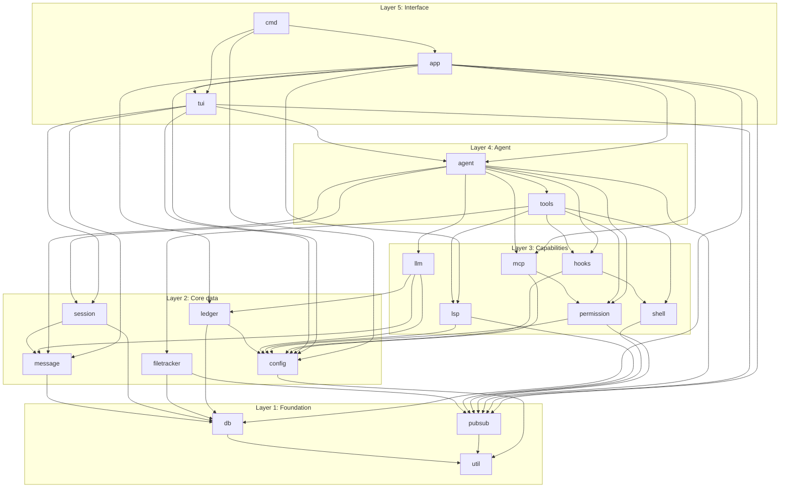

# BharatCode Architecture

## Overview

BharatCode is decomposed into **18 main modules** plus a small `util` helper package, each living under `internal/<name>/`. The decomposition follows a proven layered design so that each module maps to a single, well-named responsibility. Boundaries are strict: a module imports only the modules listed in its `Depends on` row, never reaches across layers, and exposes a small interface that the layer above consumes. Every module ships with its own `docs/modules/<name>.md` spec and is independently testable with `go test ./internal/<name>/...`.

The 18 modules are arranged in five layers from foundation to interface. Lower layers know nothing about higher layers. This is what makes the system **agent-buildable**: a fleet of AI coding agents can be assigned one module each, given the module's spec, and produce code that compiles and passes tests without coordinating with siblings — because the dependency graph is a DAG and the public interfaces are written down before any implementation begins. The locked stack (Bubble Tea v2, Cobra, sqlc, mcp-go, modernc.org/sqlite, log/slog) is documented in `AGENTS.md` and is not restated here; this document is purely the **module map**.

## Module map

## Module list

| # | Module | Path | Purpose | Depends on |
|---|---|---|---|---|
| 0 | util | `internal/util/` | Small helpers: paths, strings, formatting, fs walks. | (none) |
| 1 | db | `internal/db/` | SQLite schema, sqlc-generated queries, migrations runner. | util |
| 2 | pubsub | `internal/pubsub/` | In-process event bus (typed channels per topic). | util |
| 3 | config | `internal/config/` | `bharatcode.json` loading, provider definitions, schema validation. | util |
| 4 | message | `internal/message/` | Message and content types (text, tool_use, tool_result, image). | db |
| 5 | session | `internal/session/` | Session CRUD over SQLite, title generation, metadata. | db, message |
| 6 | filetracker | `internal/filetracker/` | Per-session file change tracking, mtime/hash diffing. | db, pubsub |
| 7 | ledger | `internal/ledger/` | INR/USD cost tracking, budget enforcement, per-session/day/month rollups. **BharatCode-exclusive.** | db, config |
| 8 | llm | `internal/llm/` | Provider abstraction: Anthropic, OpenAI, DeepSeek, Moonshot, Together, Fireworks, Groq, OpenRouter, Ollama, LM Studio. Custom thin interface — we own the provider abstraction internally rather than depending on an external LLM-abstraction SDK. | config, message, ledger |
| 9 | lsp | `internal/lsp/` | LSP manager, per-language client lifecycle, diagnostics fan-out. | config, pubsub |
| 10 | shell | `internal/shell/` | Bash execution, background jobs, output capture, signal propagation. | pubsub |
| 11 | permission | `internal/permission/` | Tool permission gating, allow-lists, `--yolo` bypass. | config, pubsub |
| 12 | hooks | `internal/hooks/` | User shell hook engine: PreToolUse, PostToolUse, SessionStart, etc. | config, shell |
| 13 | mcp | `internal/mcp/` | MCP client (stdio, HTTP, SSE) + tool bridge using `mcp-go`. | config, permission |
| 14 | tools | `internal/tools/` | Built-in tools: bash, view, edit, multiedit, write, grep, glob, ls, todo, web_fetch, web_search, diagnostics, job_output, job_kill. | shell, permission, hooks, lsp, filetracker |
| 15 | agent | `internal/agent/` | Agent loop, prompt templates, coordinator for named agents ("coder", "task"), hooked-tool decorator. | llm, tools, session, message, mcp, permission, hooks, pubsub |
| 16 | tui | `internal/tui/` | Bubble Tea TUI: chat, diff, file tree, completions, dialogs, status bar, INR ledger footer. | agent, session, message, pubsub, config |
| 17 | cmd | `internal/cmd/` | Cobra CLI: root, run, login, models, sessions, stats, update-providers. | app, tui, config |
| 18 | app | `internal/app/` | Top-level wiring: loads config, opens DB, instantiates agent, starts LSP and MCP, wires pubsub. | all of the above except cmd, tui |

> Note on numbering: `util` is item 0 because it is a leaf helper package, not an architectural module. The 18 numbered modules (1..18) are the architectural surface a contributor needs to know.

## Build order

Build modules strictly in this DAG topological order. Within a single step, listed modules have no dependency on each other and **can be built in parallel** by different agents.

| Step | Module(s) | Parallel-safe within step | Why this step |
|---|---|---|---|
| 1 | util | n/a (single) | Leaf; nothing depends on anything yet. |
| 2 | db, pubsub | **yes** — both depend only on util | Foundation services. |
| 3 | config | n/a | Needs util only, but `ledger` and several capability modules need it; sequence it before step 4. |
| 4 | message, filetracker | **yes** — message needs db; filetracker needs db + pubsub | Both touch the data plane but not each other. |
| 5 | session, ledger | **yes** — session needs db + message; ledger needs db + config | Both are independent of each other. |
| 6 | lsp, shell, permission | **yes** — lsp needs config + pubsub; shell needs pubsub; permission needs config + pubsub | Three independent capability adapters. |
| 7 | llm, hooks, mcp | **yes** — llm needs config + message + ledger; hooks needs config + shell; mcp needs config + permission | Three independent capability adapters. |
| 8 | tools | n/a | Needs shell, permission, hooks, lsp, filetracker — all available. |
| 9 | agent | n/a | Needs llm, tools, session, message, mcp, permission, hooks, pubsub. |
| 10 | tui | n/a | Needs agent, session, message, pubsub, config. |
| 11 | app | n/a | Wires everything except cmd and tui. (tui is wired by cmd via app handle.) |
| 12 | cmd | n/a | Final integration; depends on app, tui, config. |

Steps 2, 4, 5, 6, 7 are the parallelism opportunities. Steps 1, 3, 8–12 are sequence bottlenecks where one agent must finish before the next can begin.

## Parallel build strategy

The DAG above gives a fleet of AI coding agents a clear concurrency plan. Each row below is one wave; agents within a wave do not block each other.

- **Wave 0 (1 agent):** Build `util`. Half a day; trivial helpers, but everything else depends on it.
- **Wave 1 (2 agents A, B):** A builds `db` (schema + migrations + sqlc), B builds `pubsub` (typed event bus). Independent.
- **Wave 2 (1 agent):** Build `config`. Single agent because step 4 needs it. Sequence bottleneck.
- **Wave 3 (2 agents A, B):** A builds `message`, B builds `filetracker`. Both touch the DB but not each other.
- **Wave 4 (2 agents A, B):** A builds `session`, B builds `ledger`. Both touch DB; ledger also needs config. Independent of each other.
- **Wave 5 (3 agents A, B, C):** A builds `lsp`, B builds `shell`, C builds `permission`. Three independent capability adapters.
- **Wave 6 (3 agents A, B, C):** A builds `llm` (all 10 providers + tests via `httptest`), B builds `hooks` (shell-backed hook engine), C builds `mcp` (stdio/HTTP/SSE transports via `mcp-go`). Independent.
- **Wave 7 (1 agent):** Build `tools` (the 13 built-in tools). Best done as one agent because tools share patterns and a registry; could be split per-tool if time-critical.
- **Wave 8 (1 agent):** Build `agent` (loop, prompts, coordinator, hooked-tool decorator).
- **Wave 9 (1 agent):** Build `tui` (Bubble Tea: chat, diff, file tree, completions, dialogs, INR footer). Large single-agent block; split internally by component if needed.
- **Wave 10 (1 agent):** Build `app` (wiring).
- **Wave 11 (1 agent):** Build `cmd` (Cobra commands) and `main.go`.

Total: 12 waves, max 3 agents wide. A fleet of 3 concurrent agents can reach `tools` in ~8 wall-clock units; a solo agent walks the same 12 steps in sequence.

## Cross-cutting concerns

### Logging

Use `log/slog` everywhere. Module loggers are obtained from a single root logger configured in `internal/app/`. Handler defaults to `slog.TextHandler` in TTY mode and `slog.JSONHandler` in non-TTY/production mode. Log messages start with a capital letter, no trailing period. No module instantiates its own logger backend; they receive a `*slog.Logger` via constructor or read from `slog.Default()`.

### Errors

Every returned error is wrapped with `fmt.Errorf("doing X: %w", err)` so callers can `errors.Is`/`errors.As` to the underlying cause. Sentinel errors are defined in the module they originate from (e.g. `permission.ErrDenied`, `ledger.ErrBudgetExceeded`). Do not return bare `errors.New` for failure modes a caller needs to discriminate — define a sentinel.

### Context

Every public function that performs I/O, spawns a goroutine, or runs longer than ~10ms takes `ctx context.Context` as its first parameter. Background work spawned by a module is anchored to a context the caller can cancel. The agent loop cancels child contexts on session abort or budget breach.

### Testing

Standard stack: stdlib `testing` + `github.com/stretchr/testify/require`. Use `t.TempDir()` for filesystem fixtures, `t.Setenv()` for env overrides, `httptest.NewServer` for provider HTTP mocks — never call real provider APIs from unit tests. Table-driven tests where inputs vary. Integration tests that hit real providers live behind `//go:build integration` and require API keys via env. Goal: `go test ./...` runs offline in under 30 seconds.

### Configuration

Two-tier config, loaded in order (later overrides earlier):

1. **User config**: `~/.config/bharatcode/config.json` (cross-project defaults, provider keys references, ledger budgets).
2. **Project config**: `.bharatcode.json` in the current working directory (project-specific overrides: agent definitions, hooks, allow-lists).

Schema is JSON-Schema-validated at load time by `internal/config/`. Env vars (`MOONSHOT_API_KEY`, `DEEPSEEK_API_KEY`, etc.) are read at runtime and never written to disk.

### Telemetry

**No telemetry ships in Phase 1.** BharatCode does not include an `event` module in the 18-module map, and no analytics backend is wired into the binary. If telemetry is added later it will be opt-in (default off), live in a new `internal/telemetry/` module, and be documented in `docs/telemetry.md`. Until then, no network calls leave the binary except those the user explicitly initiates (LLM requests, MCP servers, web_fetch, update-providers).
